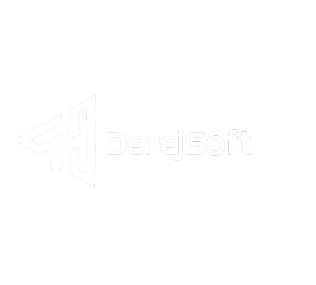

<p align="center">
    
</p>

<h1 align="center">WebDerej</h1>

<p align="center">
    <strong>Plataforma Web de Próxima Generación</strong><br>
    Experiencia HUD Cyber-Tech para el ecosistema corporativo de <strong>DerejSoft</strong>.
</p>

<p align="center">
    
    
    
</p>

---

## 💠 Visión General

**WebDerej** es el núcleo digital de **DerejSoft**, diseñado bajo una estética *High-Tech HUD* (Heads-Up Display) que fusiona funcionalidad empresarial con una interfaz futurista. La plataforma actúa como un centro de operaciones visual para presentar servicios de arquitectura de software, un portafolio dinámico de soluciones y documentación técnica/legal de alto estándar.

Destaca por su **rendimiento ultra-rápido**, diseño **Glassmorphism** y una arquitectura multipágina (MPA) optimizada para la autonomía total de cada vista.

---

## 📂 Arquitectura del Sistema

El proyecto se organiza mediante un sistema de directorios semánticos que facilitan el mantenimiento y la escalabilidad modular.

```text
webderej/
├── 🌐 Root
│   ├── index.html           # Centro de mando (Landing Page)
│   ├── nosotros2.html       # ADN Corporativo y Cultura
│   ├── blog.html            # Hub de Inteligencia (Artículos)
│   └── proyectos.js         # Motor dinámico de renderizado de portafolio
├── 📝 alticulos/            # Repositorio de micro-artículos (Blog posts)
├── 🛠️ proyectos/            # Despliegues detallados de software especializado
├── ⚖️ Documentos_Legales/    # Marco de Compliance y Privacidad
├── 🖼️ imagenes/ / imgproye/  # Assets visuales y media específica de proyectos
└── 🆔 logos/                # Activos de identidad visual y branding
```

---

## ⚡ Stack Tecnológico & Innovaciones

### Core Estático de Alto Rendimiento
*   **HTML5 Semántico:** Estructura optimizada para motores de búsqueda (SEO) y accesibilidad universal.
*   **CSS3 Advanced (Cyber-HUD):** 
    *   **Fluid Typography:** Uso de `clamp()` para escalado tipográfico perfecto en cualquier resolución.
    *   **Dynamic Viewport:** Implementación de `100dvh` para consistencia visual absoluta en navegadores móviles.
    *   **Custom Properties:** Sistema de tokens de diseño para control centralizado de temas neón.
*   **Vanilla JavaScript:** Motor de interactividad ligero para manejo de DOM, animaciones de terminal y efectos de rastreo de cursor.

### Servicios & Backend Focus
Aunque la interfaz es estática, el ecosistema de **DerejSoft** está especializado en:
*   **Backend:** Python & Django (Arquitecturas robustas).
*   **Database:** MySQL (Gestión de datos de alto volumen).
*   **Sistemas:** Implementaciones en entornos Ubuntu/Linux con Nginx.

---

## 🎨 Sistema de Diseño (Cyber-HUD UX)

La interfaz utiliza una paleta de colores curada para maximizar el contraste y la inmersión:

*   **Dark Core:** `--bg-dark: #050b14` | `--bg-card: #0a1120`
*   **Neon Accents:** Cyber Blue (`#00f2fe`), Electric Purple (`#8b5cf6`), Emerald (`#10b981`).
*   **Interacciones Premium:**
    *   **Mouse Tracking Glow:** Las tarjetas de servicios reaccionan dinámicamente a la posición del cursor.
    *   **Terminal Badge:** Animaciones de escritura tipo shell (`root@derejsoft:~$`) para reforzar la identidad tecnológica.
    *   **Glassmorphism:** Efectos de desenfoque (`backdrop-filter`) que generan profundidad visual.

---

## 🚀 Motor de Proyectos Dinámicos

La plataforma integra un sistema de carga dinámica mediante `proyectos.js`. Este script permite:
1.  **Centralización de Datos:** Gestionar todo el portafolio (DerejPres, DerejStorage, DerejMotium, etc.) desde un único array de objetos.
2.  **Renderizado Automático:** El grid de proyectos se construye en tiempo de ejecución, asegurando que cualquier cambio en la base de datos se refleje instantáneamente en el index.
3.  **Filtrado Tecnológico:** Etiquetas automáticas por stack (Django, MySQL, JS) para cada solución.

---

## 🛠️ Guía de Desarrollo y Mantenimiento

### Actualización Estética
Para modificar los tonos globales, edite los tokens en `:root`:
```css
:root {
  --primary: #00f2fe; /* Cyber Blue Principal */
  --secondary: #8b5cf6; /* Púrpura de Acento */
}
```

### Inserción de Nuevos Módulos
*   **Proyectos:** Añada el nuevo bloque de datos en `proyectos.js` y cree el HTML correspondiente en la carpeta `/proyectos/`.
*   **Blog:** Utilice `alticulos/arti.html` como plantilla para nuevas publicaciones.

---

## 📋 Checklist de Integridad (QA)

Antes de realizar un despliegue, verifique:
- [ ] Renderizado fluido en resoluciones iPhone SE (320px) hasta 4K.
- [ ] Funcionamiento del `cursor-glow` y efectos de hover HUD.
- [ ] Rutas de imágenes relativas (evitar `/` absolutos para compatibilidad en hosting).
- [ ] Velocidad de carga (Optimización de archivos `.webp`).

---

## 📞 Conexión con DerejSoft

| Canal | Identificador |
| :--- | :--- |
| **Email** | `derejsoft2003@gmail.com` |
| **WhatsApp** | `+1 829 477 2269` |
| **Instagram** | [@derejsoft](https://www.instagram.com/derejsoft/) |
| **TikTok** | [@derejsoft](https://www.tiktok.com/@derejsoft) |

---

<p align="center">
    <strong>Engineered by DerejSoft</strong><br>
    <em>Innovación Responsable. Código Limpio.</em>
</p>
